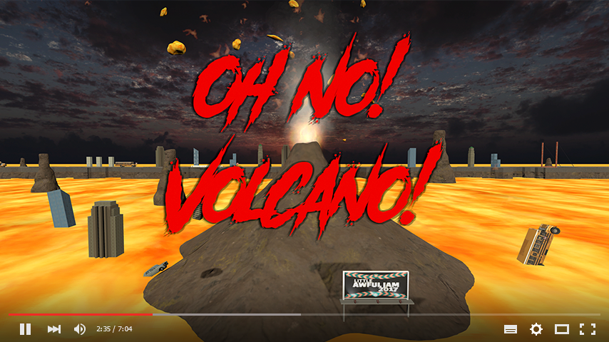

# Oh No! Volcano! Retrospective

Oh No! Volcano! was my entry to the 2017 Little Awful Jam, a two-week game jam themed around 'Panic'. Upon hearing the theme, I started brainstorming and quickly thought of a game where you had to control a crowd that was running away from something. A volcano, a tsunami, a hurricane, any natural disaster would make for interesting gameplay. And so, Oh No! Volcano! was born. The theme of 'Panic' shines through as you try to keep ahead of advancing lava while controlling a growing crowd of characters (sometimes having to control two halves of the crowd at the same time). Due to fast progress in the game's development, we were able to create an online Leaderboard using Steam's API to capture a player's Steam username. We also created a number of interesting characters to show up in your crowd, unlocked by accomplishing a set list of achievements. Fun gameplay paired with these additional features led to Oh No! Volcano! winning the jam.

[Link to jam entry](http://www.awfuljams.com/little-awful-2017/games/oh-no-volcano)

Day 1 started out strong. I made a quick prototype, using some assets from previous jams. The level was pre-set with very few obstacles, and survivors used basic physics. But as a game idea, things looked solid. [You can see my first day's progress here, a surprisingly full prototype of the concept.](https://www.youtube.com/watch?v=6_dTEwQ3RII)

The first challenge was creating repeating scenery. We wanted the game to be as fair as possible, which meant never generating impossible obstacles. Also, as we were using Unity, we couldn't prefab out working combinations: once you use one prefab as part of another, the original prefab connection is lost. An example: if we added a spring to a set of obstacles, and turned that set into a prefab, future changes to the spring prefab wouldn't effect that spring. It would take another year before Unity officially supported nested Prefabs.

We got around those issues by using additive scene loading. The workflow is: generate an interesting landscape, place prefabs on it, save it as a new scene. Each prefab in the scene keeps its original prefab connection, and we can load new scenes into the distance while you're playing. 40 such unique scenes were created and tested for Oh No! Volcano!. We then created more survivors: 5 you start with, and 10 to unlock. The higher you go, the crazier the survivors get.

Another note on fairness and balancing these scenes: originally there were a number more traps for players to fall into. Some buttons had meteors which landed on them. Some buildings were placed to strategically block your view of the path, creating blindspots. Nearly all instances of these were removed, as the challenge is less fun. Instead, most of the difficulty comes from the scaling speed of the lava. As your runners and guides also speed up, as the game goes on you can pull off tricks which were impossible at a slower speed. This allows for some very high scores, and we've hit scores above 100,000.

For splitting the crowd, we tried a few mechanics. At first the guides worked like magnets, pulling on the closest survivor. It wasn't precise enough and felt clumsy. We also played with peeling off a single survivor, or holding a bumper rather than tapping. Ultimately we felt that tapping the bumper created a sense of urgency and panic which was appropriate for the jam. It also allows for obstacles such as buttons which require a certain number of people standing on them (this was included in an earlier build of Oh No! Volcano! but removed in balancing passes).

By splitting the whole crowd, there's the additional panic of having to manage two large groups at once. A second benefit is the larger area taken up by the new group, making it easier to rescue new survivors and pick up clocks, both crucial and difficult at higher scores. There are many instances where splitting the crowd will let you rescue two groups of survivors at once, which is a massive benefit. I'm not that great at pulling it off myself, and I suspect scores much higher than 100,000 are possible.

Steam integration was actually quite 'simple': there's very little. We use Steam to get your SteamID and Username to identify you across sessions, but not store scores. We also show your avatar to indicate we connected successfully. I created the leaderboard API myself, hosted off my website. As Oh No! Volcano! isn't a proper Steam game it doesn't have an App ID, so it can't use official Steam leaderboards. Instead we use the open ID of '480' (this is why Steam shows you playing Spacewar).

Finally, if we were to continue Oh No! Volcano! we would add additional disasters to run away from, and themed stages. Perhaps we would start players off at an easier stage, running away from a hurricane with easier obstacles to avoid. Watching the leaderboard, it's clear that our game is quite difficult. The final survivor takes a score of 60,000 to unlock. Less than half the high score we were able to set, but a higher score than anyone's hit on the leaderboard.
